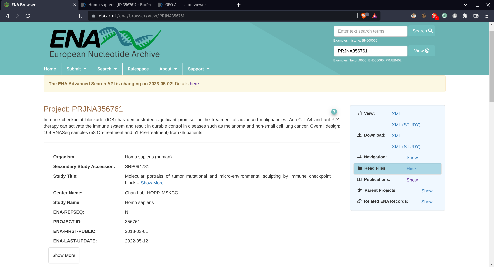
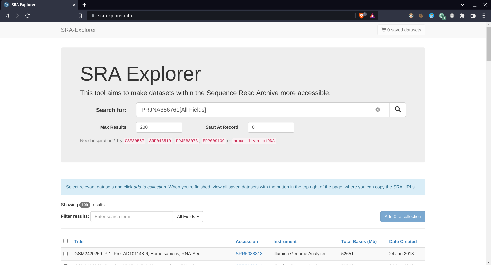
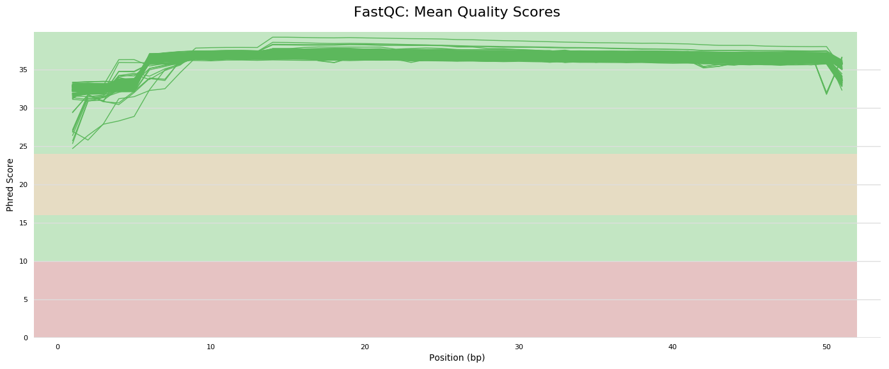
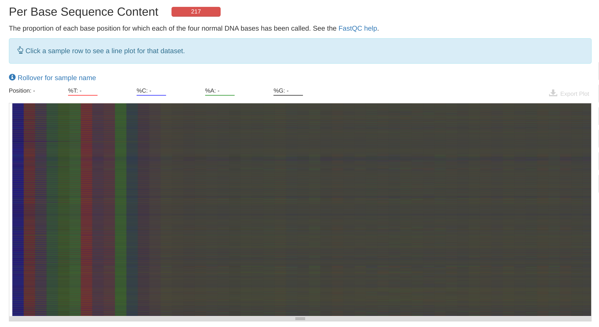
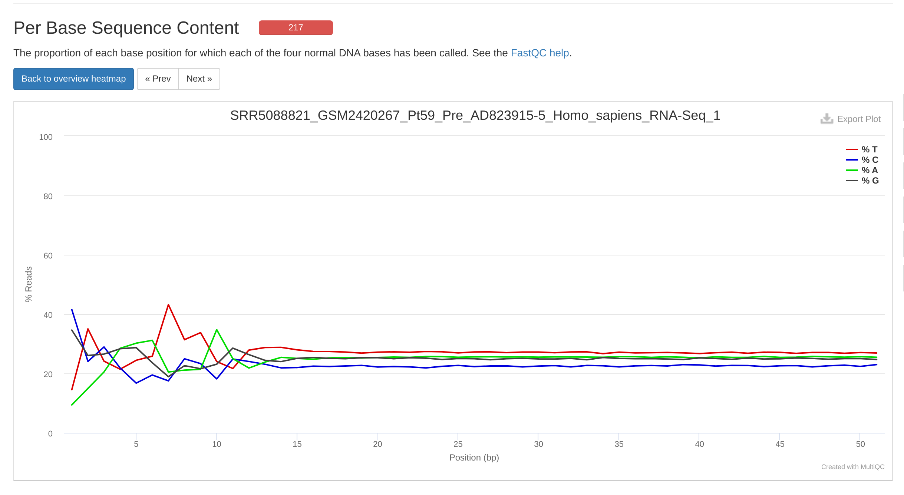
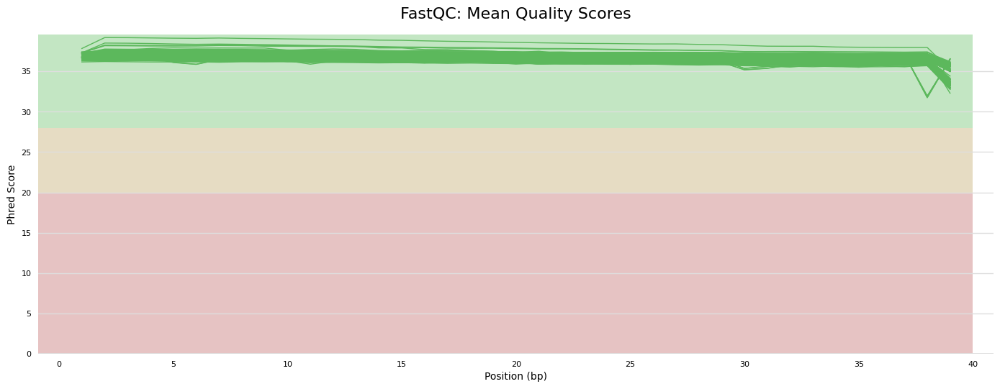
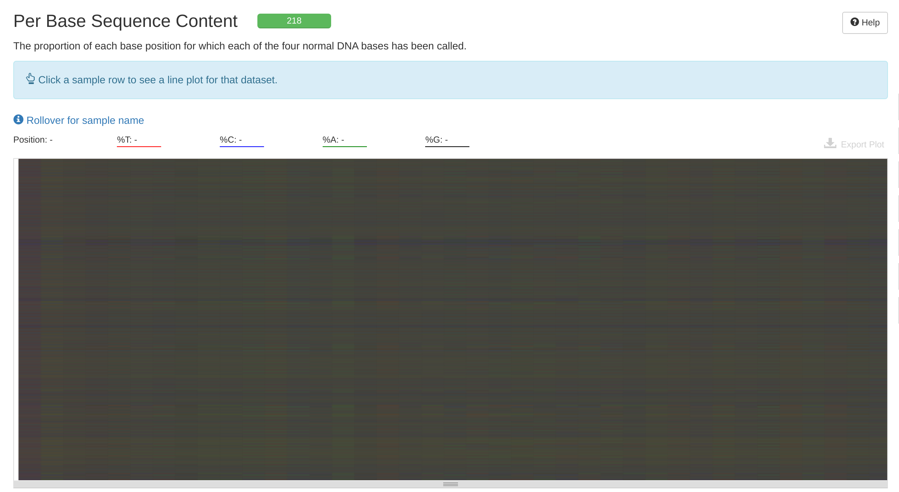
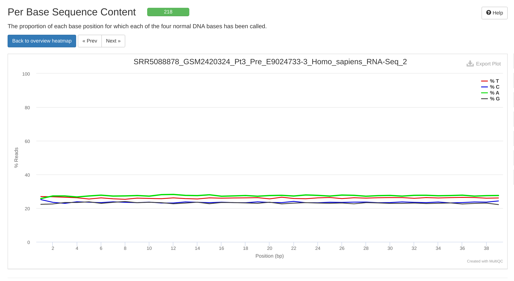
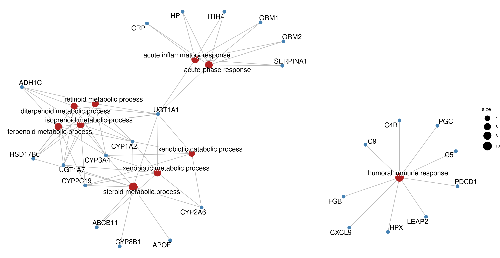

# Abstract

# Introduction

# Methods

First of all, a new directory in the DNA High-Performance Computing Cluster
was created, which is

```{bash directory, eval=FALSE}
/mnt/Timina/bioinfoII/amarin/RNAseq2/
```

This directory has the next organization:

```{bash structure, eval=FALSE}
|-data/           # Directory to download the raw data
|-data_trimmed/   # Directory to save the post-QC data
|-kallisto_out/   # Directory to save the kallisto outputs
|-QC/             # Directory to perform raw QC
|-QC_trimmed/     # Directory to perform QC on the trimmed data
|-scripts/        # Some scripts used to send jobs
```


## Download

The dataset choose to analysis has de GEO Accession 
[GSE91061](https://www.ncbi.nlm.nih.gov/geo/query/acc.cgi?acc=GSE91061). 
Since downloading from the NCBI may be difficult and quite technical, it was 
choosen to use the European mirror, the 
[European Nucleotide Archive](https://www.ebi.ac.uk/ena/browser/home) from the
EMBL-EBI. By browing on the GEO web page, we see that the data are from the 
BioProject 
[PRJNA356761](https://www.ncbi.nlm.nih.gov/bioproject/PRJNA356761). We use that
ID to search on ENA. 



Due the fact that the are a lot of file needed to be downloaded, we use the 
web application 
[SRA Explorer](https://sra-explorer.info/) to get a script to get the bulk
download.


We then select all the files and click on "Add to collection". After that, we
see our saves datasets and select the bash script for downloading FastQ files
option. We save the script with the name ```downloadScript.sh```, and save it in
the HPCC, in the ```//data/``` directory.

Then, we send a job using the script. It lasted around 5 days.


## Raw Quality Control

Once the data is ready, we perform quality control. We just send a job using 
fastqc with all the ```fastq``` files via a wildcard:

```{bash fastqc, eval=FALSE}
fastqc /mnt/Timina/bioinfoII/amarin/RNAseq2/data/*fastq.gz -o /mnt/Timina/bioinfoII/amarin/RNAseq2/QC
```

Then, we used multiqc to visualize all the samples at once:

```{bash multiqc, eval=FALSE}
multiqc /mnt/Timina/bioinfoII/amarin/RNAseq2/QC -o /mnt/Timina/bioinfoII/amarin/RNAseq2/QC
```

This allowed us to see some irregularities. First, the first to nucleotides of
each read had a smaller mean quality score, compared to the rest of the read.



Besides, in the heatmap, the base sequence sequence content seemed to be biased
on the first base pairs of the read.



All the samples resembled more or less the next percentage of base content.



Nevertheless, MultiQC didn't detect any adapter content. Based on that, we decided
to trimm the first 12 nucleotides of each pair.


## Trimming

We send a job in the  ```//data/``` directory with a script using the software
Trimmomatic:

```{bash trimming, eval=FALSE}
for i in *_1.fastq.gz;
	do echo
  	trimmomatic PE -threads 40 -phred33 -trimlog trim.log \
    	$i "${i%_1.fastq.gz}_2.fastq.gz" \
    	../data_trimmed/"${i%_1.fastq.gz}_1_trimmed.fastq.gz" \
    	../data_trimmed/"${i%_1.fastq.gz}_1_unpaired.fastq.gz" \
    	../data_trimmed/"${i%_1.fastq.gz}_2_trimmed.fastq.gz" \
    	../data_trimmed/"${i%_1.fastq.gz}_2_unpaired.fastq.gz" \
    	HEADCROP:12
  done
```

Here we just cut the first 12 nucleotides of each read and create a ```trim.log```
log file by the use of 40 threads. We know that the Phred score are based on 
ASCII 33 because previously we found a ```#``` symbol on the reads.

This job took a couple of days.

## Trimmed Quality Control

Once the data was trimmed, we did one more time the quality control.

```{bash trimmed_qc, eval=FALSE}
fastqc /mnt/Timina/bioinfoII/amarin/RNAseq2/data_trimmed/*fastq.gz \
  -o /mnt/Timina/bioinfoII/amarin/RNAseq2/QC_trimmed
multiqc /mnt/Timina/bioinfoII/amarin/RNAseq2/QC_trimmed \
  -o /mnt/Timina/bioinfoII/amarin/RNAseq2/QC_trimmed
```

This time, the quality of the first pair bases was better.



Besides, the "per base sequence content" was less biased:



Each sample was more homogeneous.



Besides, other indicators, such as the "per base N content" and "per sequence
GC content" performed better.


## Pseudoaligment to reference genome

Once the data was ready, we decided to generate count matrices using Kallisto.
To perform this, we first need a reference transcriptome. We choose the latest
version available at 
[GENCODE](https://www.gencodegenes.org/human/), which is the release 43.
The file was downloaded at the parent directory of this project:

```{bash gencode, eval = FALSE}
wget https://ftp.ebi.ac.uk/pub/databases/gencode/Gencode_human/release_43/gencode.v43.transcripts.fa.gz
```

Then, generated the kallisto index:


```{bash index, eval = FALSE}
kallisto index -i /mnt/Timina/bioinfoII/amarin/RNAseq2/kallisto_out/Hs_ref.kidx \
  /mnt/Timina/bioinfoII/amarin/RNAseq2/gencode.v43.transcripts.fa.gz
```

Then, we used a bash script to perform the quantification with all the samples.


```{bash pseudo, eval=FALSE}
for file in /mnt/Timina/bioinfoII/amarin/RNAseq2/data_trimmed/*_1_trimmed.fastq.gz
do
    op=$(basename $file | cut -c-10 )         
    file2=$(echo $file | sed 's/_1_/_2_/')  
    mkdir /mnt/Timina/bioinfoII/amarin/RNAseq2/kallisto_out/${op}
    
    kallisto quant -i /mnt/Timina/bioinfoII/amarin/RNAseq2/kallisto_out/Hs_ref.kidx \
    -o /mnt/Timina/bioinfoII/amarin/RNAseq2/kallisto_out/${op} \
    --threads 40 $file $file2
done
```


## Differencial Expresion 

For the differential expression analysis we used DESeq2, a Bioconductor package
running on R 4.3.0 using a PC. The next, are the libraries to use.

```{r libraries, warning=FALSE, message=FALSE}
library(plotly)
library(tximport)
library(tidyverse)
library(DESeq2)
library(ggplot2)
library(ggrepel) 
library(rhdf5)
library(GenomicFeatures)
library(dplyr)
library(biomaRt)
library(gprofiler2)
library(ComplexHeatmap)
library(genefilter)
library(clusterProfiler)
library(AnnotationDbi)
library(org.Hs.eg.db)
#library(ggupset)
library(enrichplot)
```

### Data importation

First, we imported the kallisto quantification tables to a local computer
from the DNA HPCC.
Then, we created a tx2gene table, which maps annotated genes with transcripts.
To do this, we used the Bioconductor package biomaRt.


```{r ensembl, warning=FALSE, message = FALSE}
ensembl = useEnsembl(biomart="ensembl", dataset="hsapiens_gene_ensembl")


tx2gene = getBM(attributes=c('ensembl_transcript_id','ensembl_gene_id'), 
                   mart = ensembl)
```

Next, we import the quantification table to the R environment. To do this, we
use the Bioconductor package rhdf5.

```{r kallisto-import}
## Paths to h5 archives
files = file.path(list.dirs("./kallisto_data", recursive = FALSE),
                  "abundance.h5")
names(files) = str_extract(files, "SRR\\d+")

## Importation
txi.kallisto.tsv = tximport(files, type = "kallisto", tx2gene = tx2gene,
                            ignoreAfterBar = TRUE, ignoreTxVersion=TRUE)

```


Next, we create a metadata table to know the treatment for each SRA sample. 
Since it wasn't available on SRA Run Selector web page, we needed to manually
create it.

```{r metadata}
## Metadata importation to R
meta = read.csv("./metadata.csv", header = FALSE)
samples = column_to_rownames(meta, var = "V1")
```

Now, we create a DESeq2 dataset-like object, called DESeqDataSet, using the
imported counts, sample names and metadata table.

```{r dds, warning=FALSE}
dds = DESeqDataSetFromTximport(txi.kallisto.tsv,
                               colData = samples,
                               design = ~V2)
```


### Exploratory Analysis

Before doing some exploration analysis, we pre-filter low counts.

```{r pre-filtering}
## Pre-filtering

keep = rowSums(counts(dds)) >= 10
dds = dds[keep, ]

## Factor level
dds$V2 = factor(dds$V2, levels = c("Pre", "On"))
```

To identify if there's a batch effect, we graph a PCA; normalizing the data
with the variance stabilizing transformation.

```{r vst, message=FALSE, warning=FALSE}
vst = vst(dds, blind = FALSE)
```

Once we hve the normalized data, we graph a tridimensional and interactive PCA plot.

```{r pca, warning=FALSE, message=FALSE}
pca = prcomp(t(assay(vst)), rank. = 3)

components = pca[["x"]]
components = data.frame(components)

var = summary(pca)[["importance"]]['Proportion of Variance',]
var = 100*sum(var)

fig = plot_ly(components, x = ~PC1, y = ~PC2, z = ~PC3, color = dds$V2)
fig = fig %>% layout(title = "PCA")
fig
```

As we can observe, there is not a visible cluster suggesting a batch effect.
In fact, by some reason, almos all the samples cluster into a big cloud, 
regardless to their treatment.


### Differential Expression Analysis

Once we know there are not batch effects in our data, we perform the Differential
Expression Analysis. 

```{r DESeq, message=FALSE, warning=FALSE}
dds = DESeq(dds)
```

To consider significant genes, we will use a significance level of
$\alpha=0.01$, and a log fold change expression greater than 1 or lower than -1.

```{r res}
res = results(dds, alpha = 0.01)

## Significative genes
resSig = subset(res, padj < 0.01)
dim(resSig)
```

We have 80 significant genes. We can visualize them in a volcano plot.

```{r volcano, message=FALSE, warning=FALSE}
res.df = as.data.frame(res)

## Add genes symbols
res.df$symbols = mapIds(org.Hs.eg.db, keys = rownames(res.df),
                        keytype = "ENSEMBL", column = "SYMBOL")


### Up and down genes
res.df$diffexpressed = "NO"
res.df$diffexpressed[res.df$log2FoldChange > 1 & res.df$padj < 0.01] <- "UP"
res.df$diffexpressed[res.df$log2FoldChange < -1 & res.df$padj < 0.01] <- "DOWN"


ggplot(data = res.df, aes(x=log2FoldChange, y=-log10(padj), col=diffexpressed, label=symbols)) + 
  geom_point() 

```

### Significant genes extraction

Once we have identified the significant genes, we extract them in tsv files. One
for the up-regulated ones, and another for the down-regulated ones.

```{r sig-extract}

## Up genes
resSigUP = subset(resSig, log2FoldChange >= 1)
resSigUP = cbind(rownames(resSigUP), resSigUP) # Converts rownames into first column
colnames(resSigUP)[1] = "GENE_ID" # Adds name to first column

write.table(resSigUP, file = "./DEG_results/UP_genes.tsv", quote = FALSE,
            sep = "\t",row.names = FALSE)


## Down genes
resSigDOWN = subset(resSig, log2FoldChange <= -1)
resSigDOWN = cbind(rownames(resSigDOWN), resSigDOWN)
colnames(resSigDOWN)[1] = "GENE_ID"

write.table(resSigDOWN, file = "./DEG_results/DOWN_genes.tsv", quote = FALSE,
            sep = "\t",row.names = FALSE)
```
 
 We got 6 significant downregulated genes and 73 upregulated significant genes.

## Gene Ontology Enrichment

To make the GO terms enrichment, we use the ```org.Hs.eg.db``` database, 
containing the annotated genes from *Homo sapiens*. The ontology was made using
the Biological Process (BP).

```{r GO, warning=FALSE, message=FALSE}
genes = rownames(resSig[resSig$log2FoldChange >= 1, ])

GO = enrichGO(gene = genes,
              OrgDb = org.Hs.eg.db,
              keyType = "ENSEMBL", 
              ont = "BP")

GO.df = as.data.frame(GO)
```

### Gene-Concept Network

We can visualize the enriched genes depending on their biological process.

```{r network, warning=FALSE, eval=FALSE}
GO2 = setReadable(GO, OrgDb = org.Hs.eg.db)

cnetplot(GO2, node_label = "all",color_category='firebrick', 
          color_gene='steelblue', showCategory = 10)
```



# Results and Discussion

Our results provide evidence that the Immunotherapy with Nivolumab helps the immune 
system recognize and attack cancer cells more effectively. In our differential gene 
expression analysis we found that 6 of our significant genes were downregulated and 
73 were upregulated in patients being treated with Nivolumab. We then performed a 
Gene Ontology (GO) enrichment analysis to gain a better understanding of the functional 
implications of our genes. This analysis show us that the enriched genes that we found 
were associated with the acute inflammatory response, acute-phase response, humoral 
immune response, metabolic and catabolic processes which makes sense as immunotherapies
work by targeting specific proteins on immune cells and cancer cells that regulate 
immune responses.

Cancerous tumor cells have the ability to produce signals that cause inflammation. 
Cancer can be affected by inflammation in both favorable and unfavorable ways. On one 
hand, it might help to attract immune cells like neutrophils and macrophages that can 
recognize and eliminate cancer cells.On the other hand, chronic inflammation can create 
a tumor-promoting environment by promoting angiogenesis and tissue remodeling, which can 
facilitate tumor growth and metastasis (Li, L. et al., 2020).

The tumor or the host immune system's response to the tumor can both initiate the 
acute-phase response in cancer (Hugo Becerril Gonzalez et al., 2018). Acute-phase protein 
levels have been found to be higher in a variety of cancers. Acute-phase proteins can be 
monitored as diagnostic or prognostic indicators in some malignancies.

The humoral immune response can be modulated by tumor cells to evade immune surveillance. 
Tumors may downregulate the expression of antigens recognized by antibodies or produce 
factors that inhibit antibody production (Anushruti Sarvaria et al., 2017). However, in 
some cases, the humoral immune response can contribute to anti-tumor immunity and be 
harnessed for therapeutic purposes.

In the the paper of the bioproject they mentioned that highly expressed genes were 
immune-related, suggesting pre-existing immune recognition of the tumor. By comparing our 
results with the paper we noticed that they had similar results as they also found 
differentially expressed genes related to host immunity, which increased their expression and 
with metabolism, which decreased their expression in responders. With this comparison, we can 
be sure that our analysis was perform correctly and that our results are assuring the efficacy 
of the immunotherapy.

# Conclusions


# References

Li, L., Yu, R., Cai, T., Chen, Z., Lan, M., Zou, T., Wang, B., Wang, Q., Zhao, Y., & Cai, Y. (2020). Effects of immune cells and cytokines on inflammation and immunosuppression in the tumor microenvironment. 88, 106939–106939. https://doi.org/10.1016/j.intimp.2020.106939

Zhao, H., Wu, L., Yan, G., Chen, Y., Zhou, M., Wu, Y., & Li, Y. (2021). Inflammation and tumor progression: signaling pathways and targeted intervention. 6(1). https://doi.org/10.1038/s41392-021-00658-5

Hugo Becerril Gonzalez, Catharina Hagerling, & Werb, Z. (2018). Roles of the immune system in cancer: from tumor initiation to metastatic progression. 32(19-20), 1267–1284. https://doi.org/10.1101/gad.314617.118

Anushruti Sarvaria, J. Alejandro Madrigal, & Saudemont, A. (2017). B cell regulation in cancer and anti-tumor immunity. 14(8), 662–674. https://doi.org/10.1038/cmi.2017.35


# Session Information

```{r session-info}
sessionInfo()
```


